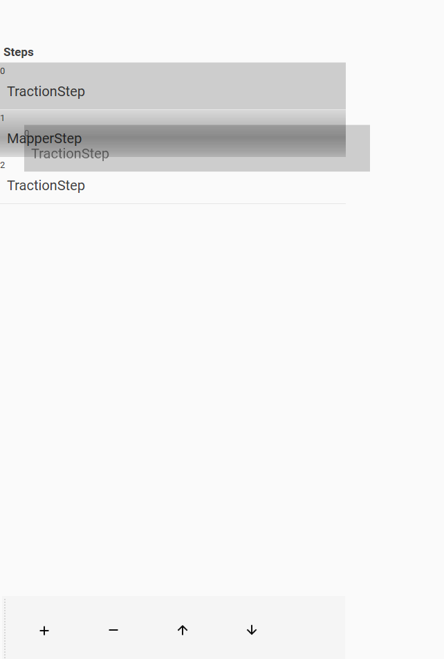

# ETMProfileEditor
 Master-Detail-View Editor

## To Do:
- [x] Everything so far
- [x] Persist changes to Steps in Profiles
- [x] Add drag-drop
- [ ] Fix steps disapearing
- [ ] Prevent user changing Profiles while Step has error.
- [ ] Fix the display of parameters within the steps

## Images

  
  
  
   
  
    
  
  
  
 
 
  
   
  
