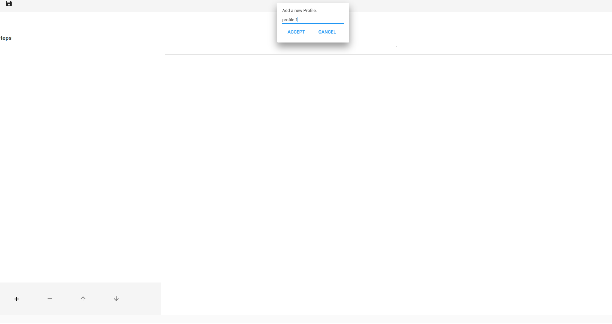
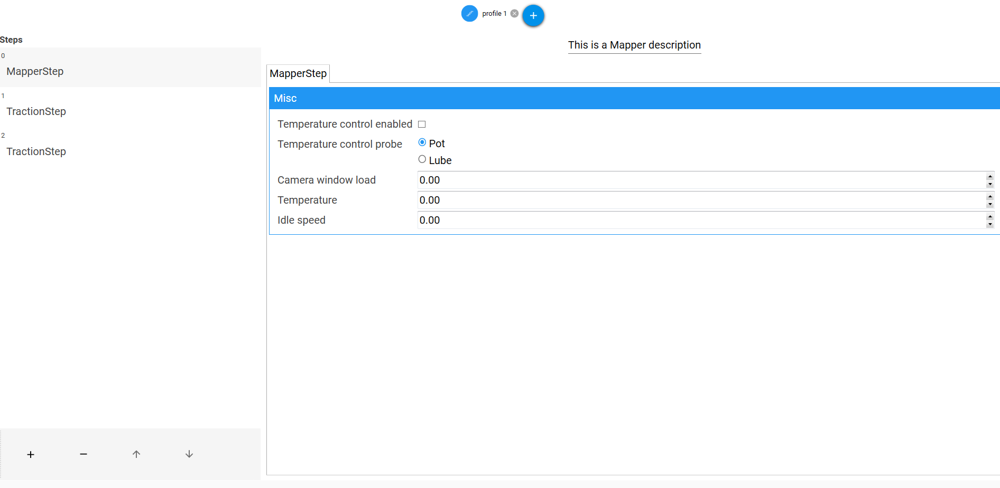
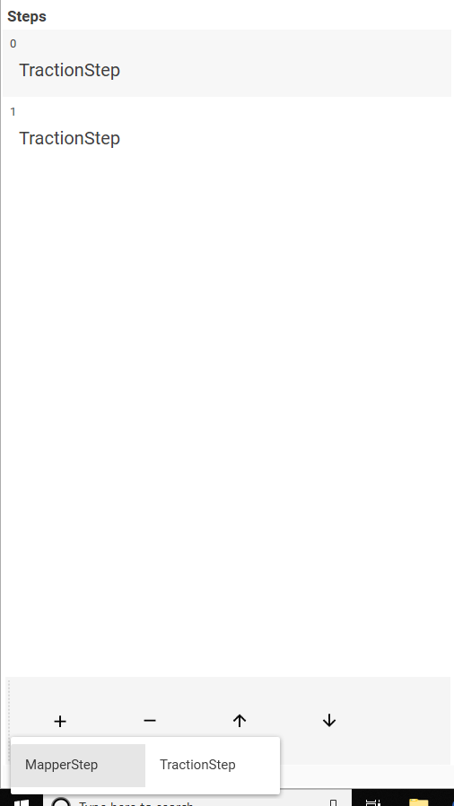
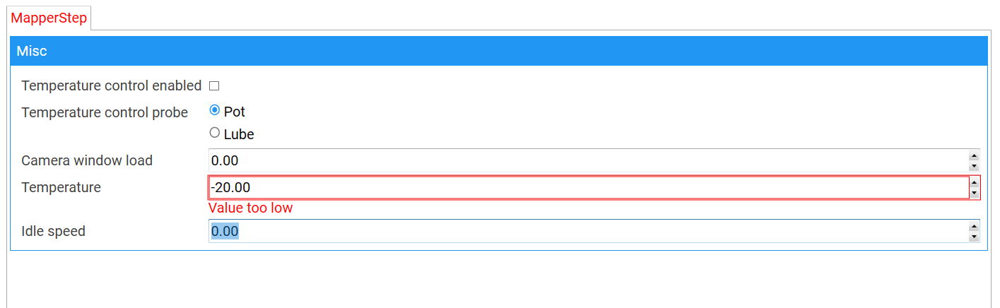
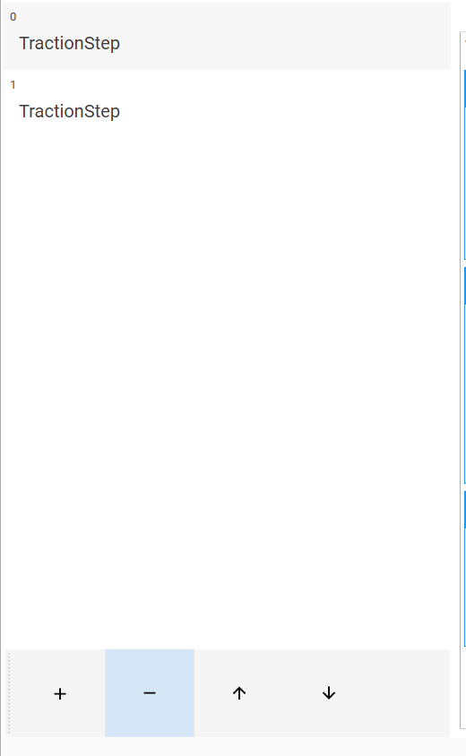
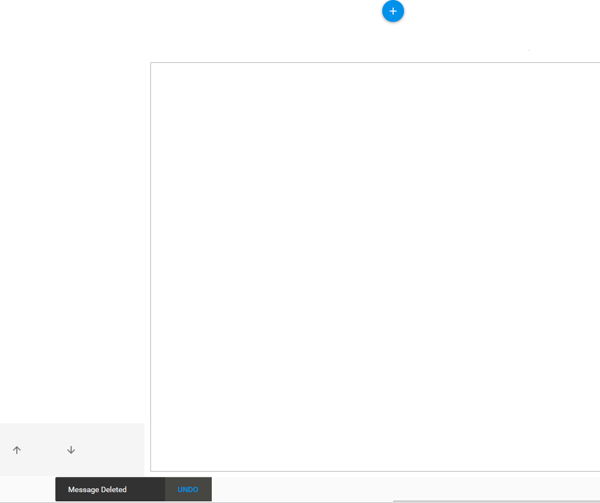

# ETMProfileEditor
 Master-Detail-View Editor

- [x] Everything so far

## To Do:

- [ ] Enable steps changing when moving between profiles 
- [ ] The display of parameters within the steps

## Images

  
  
  
   
  
    
  
  
  
 
  
   
  
